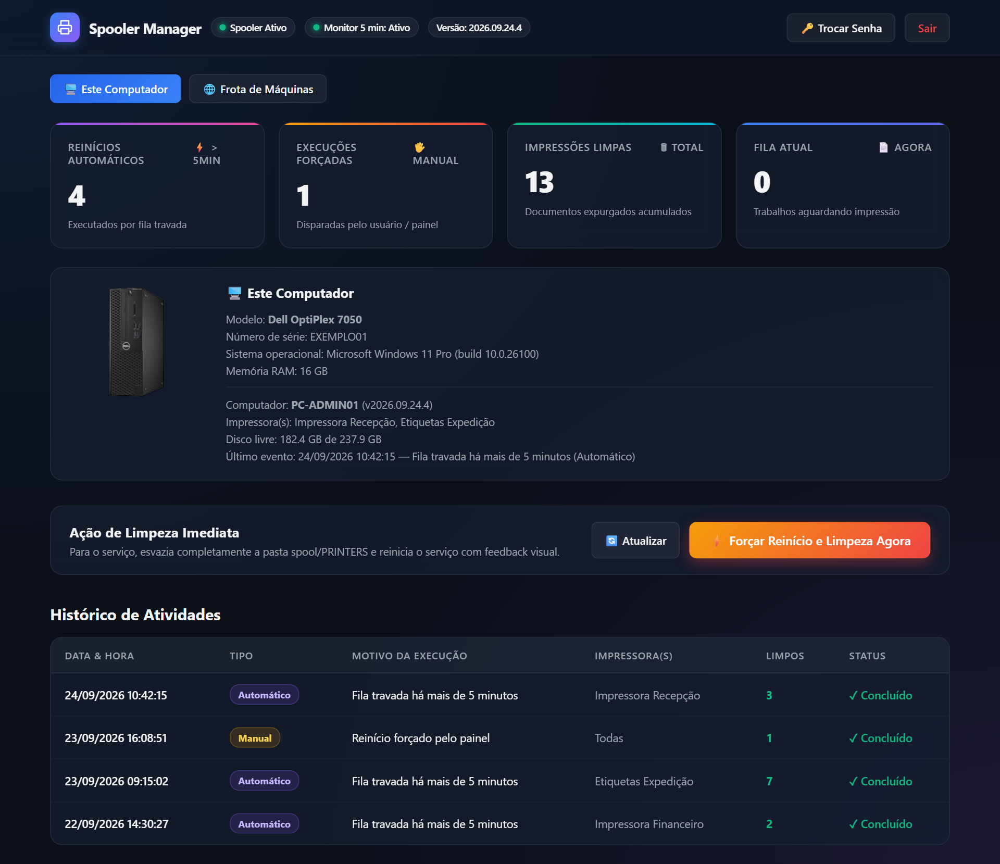
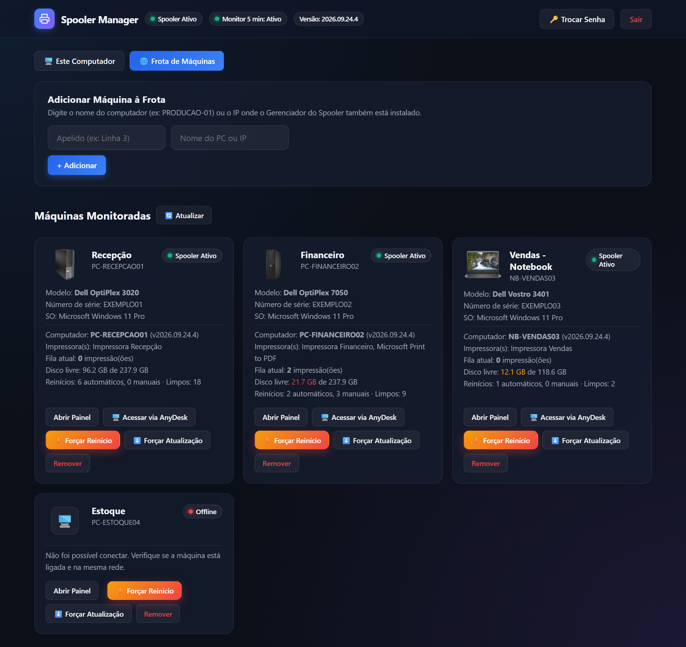
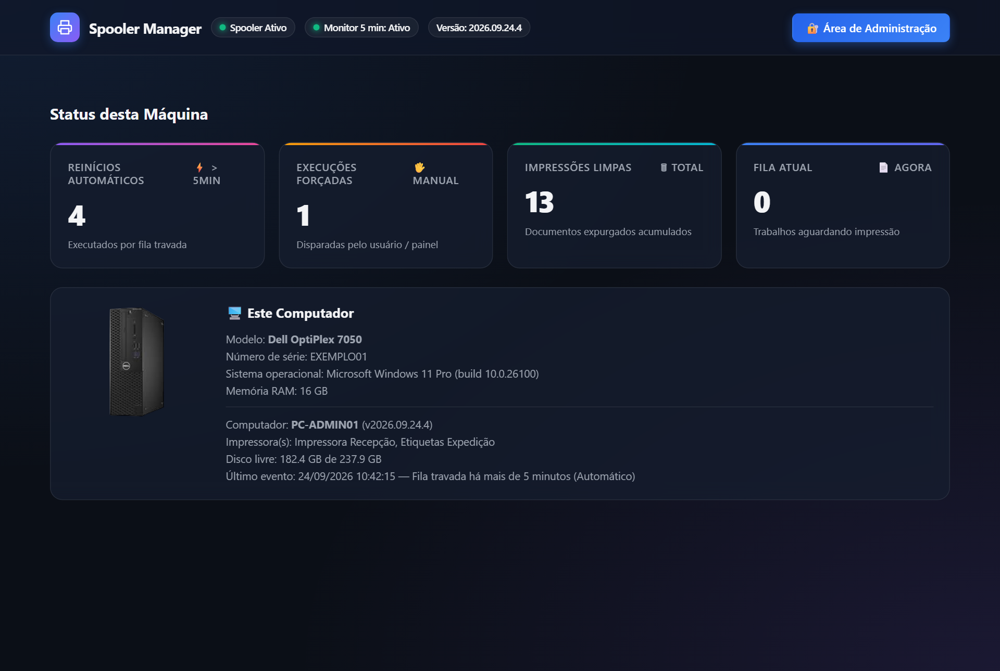
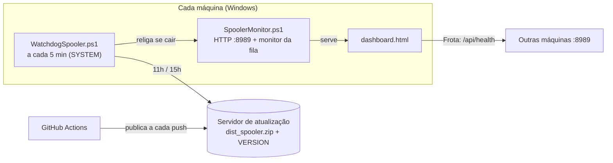

# Spooler Manager: Gerenciador do Spooler de Impressão

Monitora o Spooler de Impressão do Windows e **destrava a fila sozinho** quando uma
impressão fica presa. Também tem um painel web para acompanhar várias máquinas da
rede de um lugar só.

Foi feito para um problema clássico de suporte: a impressão trava, ninguém consegue
imprimir, e alguém da TI precisa ir até a máquina reiniciar o serviço e apagar a
fila na mão. Com o Spooler Manager isso acontece automaticamente em poucos minutos,
e fica registrado.



## Funcionalidades

- **Auto-reparo:** verifica a fila a cada 30 s. Se uma impressão fica presa por mais
  de 5 minutos, reinicia o Spooler, limpa a pasta `spool\PRINTERS` e registra o evento.
- **Painel web local** (`http://localhost:8989`): status, métricas, histórico e
  botão de limpeza imediata.
- **Frota de máquinas:** cadastre outros PCs pelo nome e veja todos num só lugar.
  Cada card mostra fila, impressoras, espaço em disco e modelo do equipamento, com
  reinício e atualização remotos e acesso rápido pelo AnyDesk.
- **Foto do equipamento por modelo:** cada máquina identifica o próprio fabricante e
  modelo e mostra a foto correspondente da biblioteca
  [`photos-by-model/`](dist_spooler/app/photos-by-model). Uma foto serve para todas as
  máquinas daquele modelo: 100 máquinas de 5 modelos precisam de 5 fotos.
- **Tela pública sem login:** qualquer usuário vê o status da própria máquina. Toda
  ação que altera algo exige autenticação.
- **Vigia (watchdog):** tarefa do sistema que roda a cada 5 minutos e religa o
  monitor se ele cair.
- **Atualização automática:** as máquinas buscam versão nova em horários fixos
  (11h e 15h), fora do horário de pico. Uma máquina que estava desligada nas duas
  janelas atualiza assim que voltar.
- **Deploy contínuo:** um push na `main` gera o pacote e publica no servidor de
  atualização via GitHub Actions.

<table>
  <tr>
    <td></td>
    <td></td>
  </tr>
  <tr>
    <td align="center">Frota de máquinas</td>
    <td align="center">Tela inicial (sem login)</td>
  </tr>
</table>

> Os prints usam dados fictícios. Eles são gerados por
> [`tools/gerar_prints_readme.py`](tools/gerar_prints_readme.py), que abre o painel
> com a API simulada.

## Como funciona



Tudo roda em **PowerShell puro**, sem nada para instalar além do próprio pacote.

| Arquivo | Papel |
|---|---|
| `SpoolerMonitor.ps1` | Servidor HTTP local (API + painel) e monitoramento da fila |
| `LimparSpoolerCore.ps1` | Rotina de parar o serviço, limpar a fila e reiniciar |
| `WatchdogSpooler.ps1` | Religa o monitor e aplica atualizações nos horários fixos |
| `AtualizarAgora.ps1` | Baixa e instala a versão nova (usado pelo vigia e pelo painel) |
| `TrayHelper.ps1` | Ícone de status na bandeja |
| `dashboard.html` | Painel web (HTML + JS, sem dependências) |

## Instalação

1. Copie a pasta `dist_spooler` para a máquina.
2. Rode `Instalar.bat` e aceite o pedido de administrador (UAC).
3. Abra o atalho **Painel Admin - Spooler** na Área de Trabalho. O login inicial é
   `admin` / `admin`.

> ⚠️ **Troque a senha padrão** pelo botão **Trocar Senha** do painel. Todas as
> máquinas de uma mesma Frota precisam usar a mesma senha.

O guia completo para o usuário final está em
[`dist_spooler/README.txt`](dist_spooler/README.txt).

### Atualização automática (opcional)

Sem configuração, o app funciona normalmente, só não se atualiza sozinho. Para ativar:

1. Hospede `dist_spooler.zip` e `VERSION` em qualquer servidor HTTP da sua rede.
2. Crie `dist_spooler/app/config.json` a partir do
   [`config.example.json`](dist_spooler/app/config.example.json):

   ```json
   { "update_base_url": "http://seu-servidor:8990" }
   ```

3. Para publicar pelo GitHub Actions ([`deploy.yml`](.github/workflows/deploy.yml)),
   configure os secrets `VPS_HOST`, `VPS_PATH`, `UPDATE_BASE_URL` e
   `VPS_SSH_PRIVATE_KEY`. O workflow gera o `config.json` e se recusa a publicar um
   pacote sem ele.

Se uma máquina parar de atualizar, veja
[`docs/RECUPERACAO-ATUALIZACAO.md`](docs/RECUPERACAO-ATUALIZACAO.md).

## Desenvolvimento

```powershell
pip install -r tools/requirements.txt
python -m pytest tools/tests -v        # roda contra o monitor local em :8989
python -m pytest tools/tests -m vps    # confere o pacote publicado no servidor
```

- Os testes da API rodam contra a instância local já instalada. Os testes marcados
  `vps` são pulados automaticamente quando não há `config.json`.
- [`tools/fetch_machine_photo.py`](tools/fetch_machine_photo.py) adiciona um modelo
  novo à biblioteca: baixa a foto do produto, remove o fundo (rembg) e recorta. Se o
  seu modelo ainda não está lá, contribuições são bem-vindas: cada foto nova passa a
  servir para todo mundo que tiver aquele equipamento.
- **Checagem de dados sensíveis:** ative uma vez por clone com
  `git config core.hooksPath .githooks`. A partir daí, todo commit com um endereço
  IP ou um termo da sua lista de proibidos (arquivo de padrões fora do repositório)
  é recusado. A mesma checagem, junto com o [gitleaks](.gitleaks.toml), roda no
  GitHub a cada push e antes de cada deploy (secret `SENSITIVE_PATTERNS`).

## Segurança

- **Somente rede interna:** o painel usa HTTP sem TLS na porta 8989. Nunca exponha
  essa porta à internet.
- **Endpoints de leitura são públicos, os de ação exigem login:** status e
  inventário podem ser lidos sem login, mas reiniciar, atualizar e gerenciar a
  Frota exigem token.
- **A senha nunca trafega em texto:** o navegador envia só o hash SHA-256.

## Licença

[MIT](LICENSE): pode usar, modificar e distribuir, mantendo o aviso de autoria.

As fotos de equipamentos em `photos-by-model/` são imagens de produto dos respectivos
fabricantes. Elas estão aqui só para identificar visualmente os equipamentos no
painel, não fazem parte da licença MIT, e as marcas pertencem aos seus donos.

---

Desenvolvido por [@kevincriscastro-boop](https://github.com/kevincriscastro-boop).
